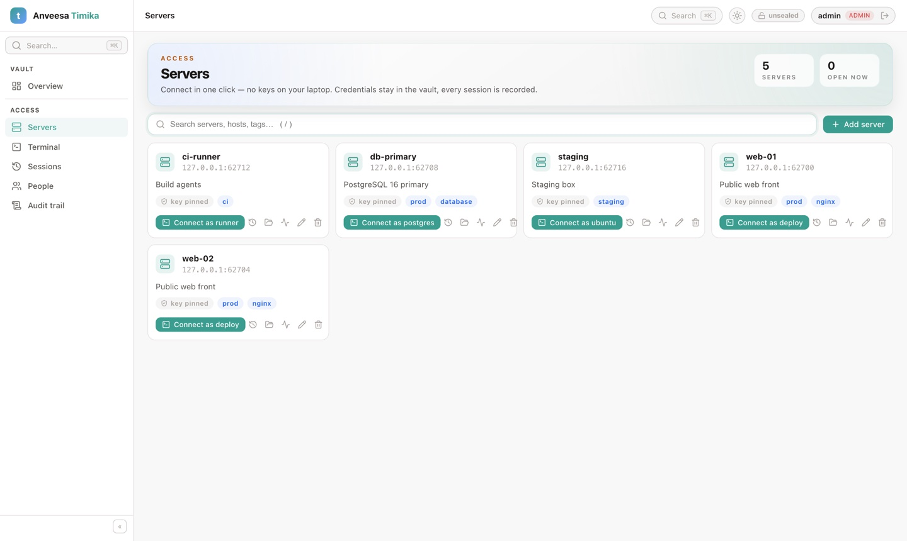
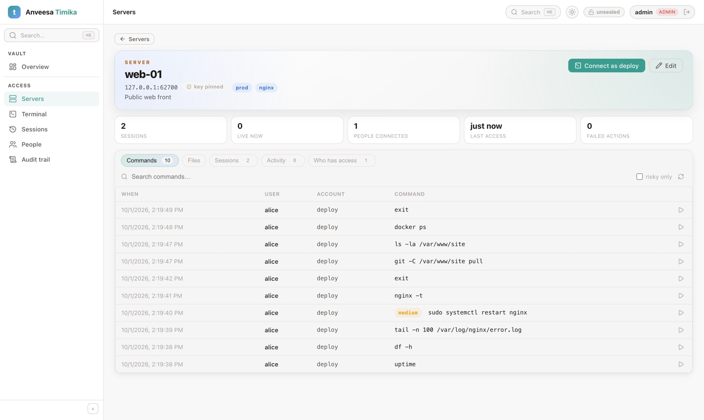
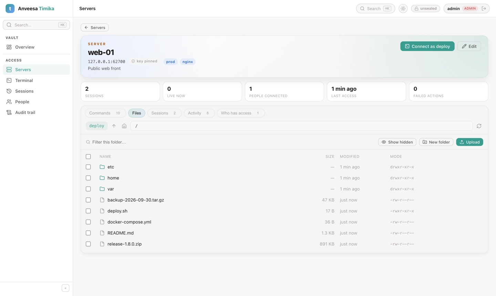
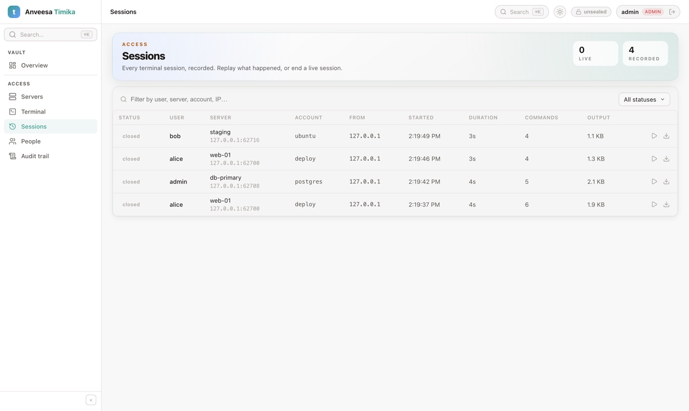
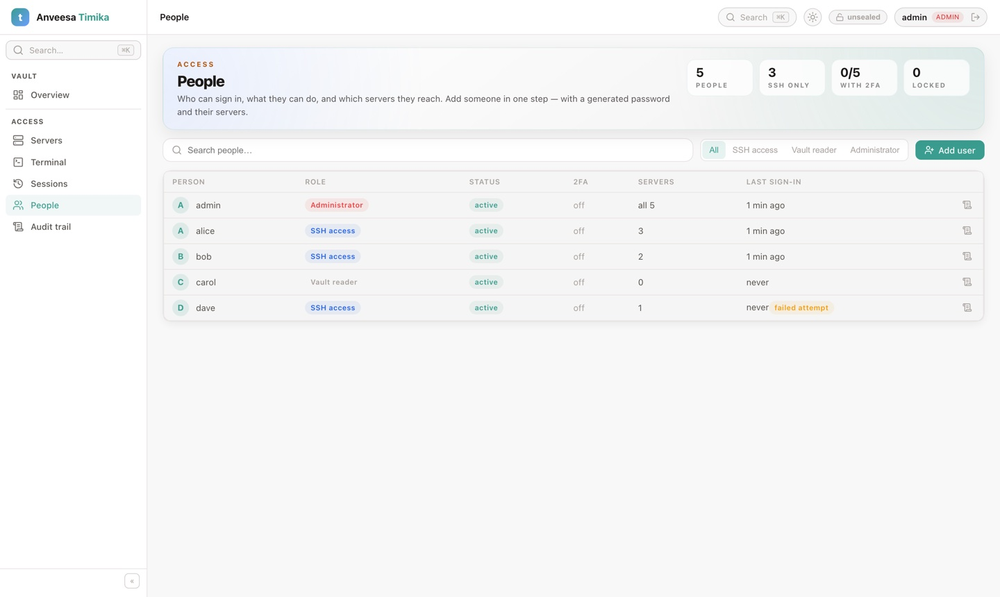
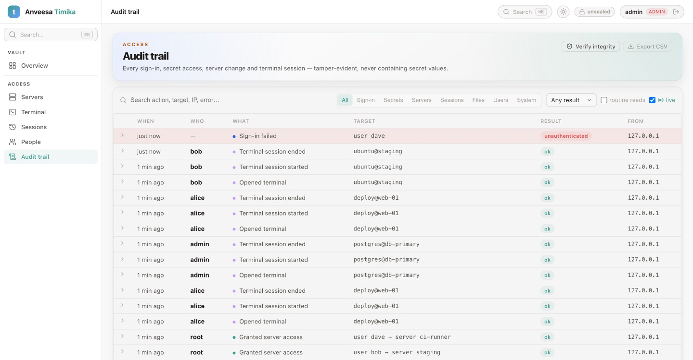
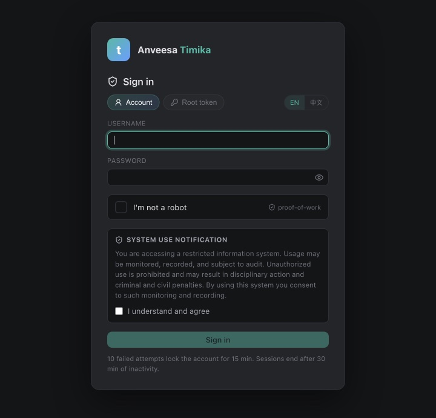

# anveesa-timika

A **vault and bastion** in one: a Rust encryption barrier holds everything —
server credentials, session recordings, users — in front of pluggable storage
(**integrated Raft** with no external database, or **Redis** standalone /
Sentinel / Cluster). People reach servers **through** timika: one-click web
terminals, files over SFTP, every session recorded and every command logged,
with no keys on anyone's laptop.



```
 Browser (Svelte 5) ── gRPC-Web ─┐                       ┌─ SSH / SFTP ─▶ your servers
 CLI / services ───── gRPC ──────┤                       │   (pinned host keys, stored creds)
 Terminal ─────────── WebSocket ─┼─▶ timika (Rust) ──────┘
                                 │    ├─ sign-in: password · captcha · 2FA (TOTP) · lockout
                                 │    ├─ bastion: terminals · recordings · command log · files
                                 │    ├─ audit trail (hash-chained, fail-closed)
                                 │    ├─ barrier: AES-256-GCM, keyring with terms
                                 │    └─ seal: Shamir-split root key (or auto-unseal), memory only
                                 │            │ ciphertext only
                                 ▼            ▼
          STORAGE=raft:  3/5 timika nodes, each with a redb copy, replicated by Raft
          STORAGE=redis: Redis standalone · Sentinel · Cluster (AOF, noeviction, optional WAIT)
```

## Quick start (no Docker)

```bash
make install            # frontend deps (bun)
STORAGE=raft make dev   # backend :8200 (data in backend/data/raft) + UI :5174
```

Open http://localhost:5174:

1. **Initialize** (e.g. 5 shares / threshold 3) — save the unseal keys and the
   root token; they're shown once.
2. **Unseal** with 3 of the keys, sign in with the root token.
3. **People → Add user** to create your admin account (generate a password),
   sign in as it, and turn on two-factor in **My account**.
4. **Servers → Add server** → host, `root` + its password → **Test & save**.
   **Connect** opens a terminal.

Restart the backend and the vault comes back **sealed** (data intact) until the
keys are entered again — or use auto-unseal ([AUTO-UNSEAL.md](docs/AUTO-UNSEAL.md)).

With Redis instead: `make redis && make dev` (`STORAGE=redis` is the default in
`backend/.env`).

## What's in the UI

| Page | |
|---|---|
| **Overview** | Seal state, keyring, storage health |
| **Servers** | One-click terminals; add/edit servers; create Linux users with generated passwords, sudo and groups ([ACCESS.md](docs/ACCESS.md)) |
| Server page | **Commands** (searchable, risky ones flagged, replay from any command) · **Files** (SFTP: upload, download, compress / extract zip & tar) · **Sessions** · **Activity** · **Who has access** |
| **Terminal** | Tabs that keep running in the background, full screen, reconnect |
| **Sessions** | Every recorded session — replay, download `.cast`, end live ones |
| **People** | Users, roles (SSH access · Vault reader · Administrator), 2FA status, server grants |
| **Audit trail** | Who did what, filterable, live, CSV export, integrity check |
| **My account** | Password and two-factor authentication |

Sign-in follows US (NIST) or China (等保 2.0) policy profiles with captchas for
both regions, optional or required 2FA ([LOGIN.md](docs/LOGIN.md)).

### Screenshots

**A server's command log** — every command typed in a web terminal, who ran it,
risky ones flagged; ▶ replays the session from that moment.



**Files over SFTP** — browse, upload, download, compress and extract on the server.



**Sessions** — every terminal session recorded, with replay and download.



**People** — roles, 2FA, how many servers each person reaches.



**Audit trail** — who did what, to what, from where; hash-chained.



<p align="center"></p>

<sub>Screenshots are from a demo vault with made-up servers and people.</sub>

### Redis Sentinel / Cluster

```bash
make redis-sentinel-up   # primary + 2 replicas + 3 sentinels + timika on :8200
make redis-cluster-up    # 6-node Redis Cluster + timika on :8200
```

Set `REDIS_MODE=sentinel|cluster`; see [`docs/REDIS.md`](docs/REDIS.md) for
configuration, `REDIS_WAIT_REPLICAS`, and measured failover times.

### Raft cluster (HA)

```bash
make raft-dev    # 3 nodes: :8200, :8210, :8220 (no Docker)
make frontend    # UI → timika-0
```

Initialize timika-0, unseal it, then unseal timika-1 and timika-2 with the same
keys. They join automatically. Kill the leader and a new one takes over within
about 2s. Containers: `make raft-up`. Kubernetes: `deploy/helm/timika`. VMs and
systemd: [`docs/RAFT.md`](docs/RAFT.md).

### Scale out (N replicas: plain Docker, Swarm, Kubernetes)

```bash
make scale-up REPLICAS=3         # Redis + 3 timika replicas + seal-aware HAProxy on :8200
docker compose -f deploy/scale/docker-compose.yml exec timika /app/timika operator init
docker compose -f deploy/scale/docker-compose.yml exec timika /app/timika operator unseal --all
```

Replicas coordinate through guarded (compare-and-swap) commits, a live instance
registry, and seal-all. Add **auto-unseal** (`SEAL_TYPE=transit|awskms|static`, see
[`docs/AUTO-UNSEAL.md`](docs/AUTO-UNSEAL.md)) and new replicas unseal themselves. See [`docs/SCALING.md`](docs/SCALING.md) for Swarm
stacks and the Helm chart (`backend=redis` Deployment or `backend=raft` StatefulSet).

### CLI (built into the image)

```bash
timika operator status | instances | init | unseal [--all] | seal [--all] | health
timika operator audit-verify /var/log/timika/audit-<instance>.log | audit-hash <token>
```

## API

gRPC (`proto/timika/v1`): native gRPC for services and the CLI, gRPC-Web for the
browser UI, on the same port. Plain `GET /v1/sys/health` stays for load balancers,
and the web terminal is a WebSocket. Full reference: [`docs/API.md`](docs/API.md).

```bash
grpcurl -plaintext -import-path proto -proto timika/v1/kv.proto \
  -H "x-timika-token: $TOKEN" -d '{"path":"app/db","data":{"password":"s3cret"}}' \
  localhost:8200 timika.v1.KvService/Write
```

With Raft, any node accepts any call; followers forward writes to the leader.

## Docs

- [`docs/ACCESS.md`](docs/ACCESS.md): **servers, terminals, command log, files (SFTP) and archives, sessions, people, roles and the audit trail** — the user & admin guide.
- [`docs/API.md`](docs/API.md): the gRPC API (services, auth, status codes, gRPC-Web, load balancers).
- [`docs/PERSISTENCE.md`](docs/PERSISTENCE.md): how storage works, and how to make Redis durable enough for a vault.
- [`docs/LOGIN.md`](docs/LOGIN.md): sign-in with username, password, captcha and **two-factor (TOTP + recovery codes)**; US (NIST) and China (等保 2.0) policy profiles; captcha providers for both regions.
- [`docs/LOGGING.md`](docs/LOGGING.md): operational logs (rotating JSON files) and the fail-closed, hash-chained audit log (file / syslog), including `audit-verify`.
- [`docs/AUTO-UNSEAL.md`](docs/AUTO-UNSEAL.md): auto-unseal via Vault/OpenBao Transit, AWS KMS or a static key, including migrating from Shamir.
- [`docs/SCALING.md`](docs/SCALING.md): running N replicas on plain Docker, Swarm or Kubernetes, with concurrency, unseal-all, seal-all and routing.
- [`docs/REDIS.md`](docs/REDIS.md): Redis standalone, Sentinel and Cluster, with key layout, WAIT durability and failover.
- [`docs/RAFT.md`](docs/RAFT.md): integrated Raft covering the join protocol, operations, and deploying on Kubernetes and on VMs.

## Stack

| Layer | Tech |
|-------|------|
| Backend | Rust · axum 0.7 · tonic 0.12 (gRPC + gRPC-Web) · tokio · aes-gcm · sharks (Shamir) · redis-rs 0.27 · openraft 0.9 + redb 2 · russh 0.63 + russh-sftp · argon2 · TOTP (RFC 6238) · auto-unseal: Transit / AWS KMS (SigV4) / static |
| Frontend | Svelte 5 (runes) · Vite 6 · TypeScript · Connect (gRPC-Web, protobuf-es) · xterm.js · @lucide/svelte |
| Tests | `make test` (unit + type checks) · `make e2e` — 272 end-to-end scenarios on real processes ([frontend/e2e](frontend/e2e/README.md)) |
| Storage | Redis 7 standalone / Sentinel / Cluster **or** integrated Raft |
| Deploy | Docker · compose (scaled) · Docker Swarm stacks · Helm (Deployment/StatefulSet) · systemd · HAProxy |
