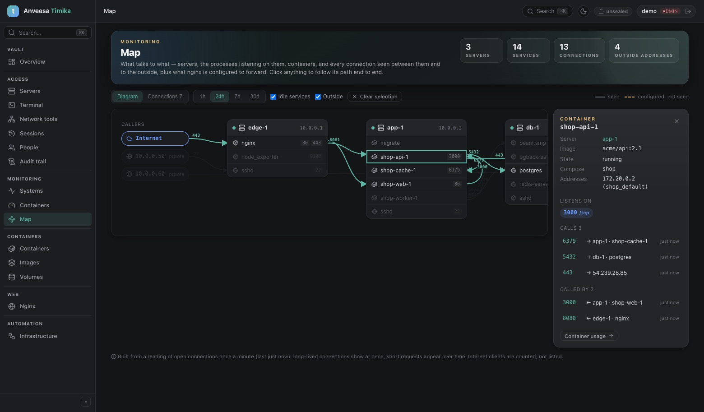
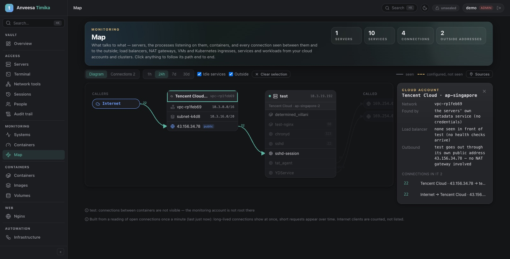

# Map — what talks to what

*Monitoring → Map* draws your infrastructure from what timika observes: servers,
the processes listening on them, containers, and every connection between them
and to the outside — plus what nginx is configured to forward. There is no
agent and nothing to configure: it is built from the same SSH reading as
monitoring, once a minute.

## What is captured

| | From | Detail |
|---|---|---|
| **Addresses** of each server | `ip -o addr` | used to recognise "that peer is `db-1`" |
| **Listeners** | `ss -tulnp` | port, protocol, bind address (public or local only), the process |
| **Open connections** of the server | `ss -tnp state established` | both ends, and the process that holds it |
| **Containers** | `docker` / `podman inspect` | addresses per network, compose project, published ports |
| **Connections inside each container** | `nsenter -n ss` (root only) | container → container, container → another server, container → internet |
| **What nginx forwards** | its configuration, every 10 minutes | site → upstream servers, also when no connection is open |

From these, each reading yields **flows**: *who* (a process, or a container)
connects to *which address and port*, or is connected to on which port. A flow
keeps when it was first and last seen, in how many readings, and its peak
(connections at once, or distinct clients). Flows not seen for 30 days are
forgotten; at most 1500 are kept per server.

## Detect with: VMs only, or Cloud API

A switch above the diagram (administrators) chooses how the map is detected:

| | VMs only (default) | Cloud API |
|---|---|---|
| From | your servers alone: their metadata service, interfaces, routes and connections | the same, plus the cloud providers' APIs |
| Credentials | none | a read-only API key per cloud (kept in the vault, or the CLI on a server) |
| Load balancers, NAT gateways | inferred (health checks; no public address) | listed by name, with listeners, targets and routes |
| Other VMs | only the servers you added | every VM in the account |
| Kubernetes | yes (through a server's `kubectl`) | yes |

Choosing **Cloud API** for a cloud your servers run in asks for its key at once,
with the provider and regions already filled in from what the servers said —
"Connect Tencent Cloud (ap-singapore)". With **VMs only**, no cloud API is
called at all; the keys stay stored and are used again when you switch back.

## Where a server is — found without setup

Every ten minutes each server is also asked where it runs. On AWS, Tencent
Cloud, Google Cloud and Azure the machine's own **metadata service** answers,
with no credentials (it is only tried when the machine's DMI names that cloud):

- **The server's card** says its cloud and zone; its details list the instance
  id and type, VPC and subnet with their address ranges, private and public
  address (and whether it is an EIP), image, bandwidth cap, security groups
  (AWS), every network interface with its prefix (`eth0 10.3.19.192/20`,
  `docker0 172.17.0.1/16`), the routing table, default gateway and DNS.
- **A cloud card** per network holds the **VPC** and **subnet** with their
  ranges, and what stands between its servers and the internet:
  - the server's **public address** — internet traffic is drawn through it;
  - a **load balancer, inferred** when the cloud's health checks arrive
    (Tencent Cloud, Google Cloud, Azure; AWS's can't be told apart);
  - a **NAT gateway, inferred** when a server has no public address yet talks
    to the internet.
- **A cluster**: when a server has a `kubectl` that reaches a cluster, that
  cluster is added as a source through that server, by itself. Remove it under
  Sources and it stays removed.

The card also says what was looked for and **not** found — "Load balancer: none
seen in front of test", "Outbound: test goes out through its own public address
— no NAT gateway involved" — so an empty card is an answer too.

Inferred means: timika knows it is there, not what it is called. Its name,
listeners and other targets come from the account, under Sources.

## Clouds and clusters

Under **Sources** (administrators) you add Kubernetes clusters and AWS, Tencent
Cloud, Google Cloud or Azure accounts. Their load balancers, NAT gateways, VMs,
ingresses, services and workloads appear on the map, joined with your servers:
see [SOURCES.md](SOURCES.md).

## How both ends are joined

When you open the map, every flow is resolved against all your servers:

- an address of another monitored server → that server, and on it whatever
  answers on the port: the **container** behind a published port, else the
  **process** listening there, else the server itself;
- an address of a container on the same server → that container;
- loopback, or a container's gateway → the same server's service on that port;
- anything else → an **outside address** (marked public or private).

An outgoing connection knows both ends, so it wins; an incoming one only adds
what the other side could not tell (a client that is not monitored). Clients on
the internet are **counted, never listed**: one "Internet" node, with the peak
number of distinct clients. The container runtime's own port proxy
(`docker-proxy`) is treated as plumbing: traffic to a published port leads to
the container.

## Reading it

- **Diagram.** Servers are cards, in columns in the direction traffic flows;
  callers from outside on the left, what is called outside on the right. Rows
  are containers and processes with their ports. A solid line was **seen**; a
  dashed amber one is **configured in nginx but not seen**.
- **Click anything** — a row, a server, a line — and everything up- and
  downstream of it stays lit: the end-to-end path through it. The panel shows
  its addresses and ports, what it calls and what calls it, or for a
  connection: both processes, first / last seen, readings, peak, the nginx
  sites that use it, and notes such as "published port 8080 → 3000".
- **Connections** is the same data as a table, filterable, limited to the
  selected path when something is selected, with **CSV** export.
- **Range** (1h · 24h · 7d · 30d) is "seen within". **Idle services** shows or
  hides listeners nobody talks to; **Outside** shows or hides everything that is
  not one of your servers.

## Who sees what

Anyone sees the servers they have access to. A server they may not see appears
only as an address, never by name.

## Limits

- **A reading once a minute is a sample.** Long-lived connections (databases,
  proxies with keep-alive, queues) show at once; short requests appear over
  time, or only as nginx's configured (dashed) edge.
- **Connections inside containers need root** (the monitoring account) and
  `nsenter`. Without it the map says so, and shows containers with their
  published ports only.
- **NAT and load balancers hide the real peer:** behind one, the server sees the
  balancer's address.
- **Process names of other users** need root; otherwise the edge leads to the
  server or the port.
- TCP only for connections (UDP listeners are shown). No traffic volume per edge.
- Kubernetes and clouds come from [sources](SOURCES.md): what they forward is
  configuration (dashed), not observed traffic.
