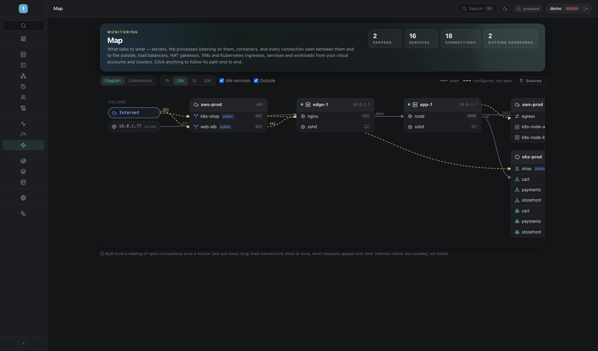

# Sources — clusters and cloud accounts on the map

A server can only tell what it sees from the inside. Load balancers, NAT
gateways, VMs you don't monitor, and a Kubernetes cluster's ingresses, services
and workloads live in the cloud's and the cluster's APIs. A **source** is one
such account or cluster; *Monitoring → Map → Sources* (administrators) adds
them, and what they hold joins the [map](MAP.md).

| Source | What is read |
|---|---|
| **Kubernetes** | nodes · workloads (pods grouped by their Deployment / StatefulSet / DaemonSet / CronJob) · services with their ports, node ports and load balancer · ingresses with hosts, paths and backends |
| **AWS** | EC2 instances · ALB / NLB / GWLB with listeners, target groups, targets and their health · NAT gateways and the subnets routed through them |
| **Tencent Cloud** | CVM instances · CLB with listeners, rules and targets · NAT gateways and the subnets routed through them |
| **Google Cloud** | Compute instances · load balancers: forwarding rule → proxy → URL map → backend service → the instances of its managed group · Cloud NAT |
| **Azure** | virtual machines (addresses from their network interfaces) · Load Balancer rules and backend pools · Application Gateway · NAT gateways and their subnets |

Everything is **read-only** (`get` / `list` / `Describe*`), every five minutes,
by the instance that collects monitoring. Cloud accounts are read and drawn only
while the map detects with **Cloud API** (see [MAP.md](MAP.md#detect-with-vms-only-or-cloud-api));
Kubernetes clusters in both modes.

## Two ways in

| | CLI on a server | Credentials in the vault |
|---|---|---|
| How | timika runs `kubectl` / `aws` / `tccli` / `gcloud` / `az` over SSH on a monitored server, as its monitoring account | timika calls the API itself |
| You need | the CLI installed there and signed in | a read-only credential, and the timika host must reach the API |
| Stored in timika | nothing | the credential, encrypted, never returned |

Both give the same result: per provider one parser reads the CLI's JSON and the
API's answer alike.

**Read-only credentials for the vault**

- **Kubernetes:** the API server's address, a service-account token that may
  `get` and `list` nodes, pods, services and ingresses in all namespaces, and
  the cluster's CA certificate when it is not from a public authority.
  (kubeconfig files that run a login helper — EKS, GKE — can't be used here:
  use a token, or the CLI on a server.)
- **AWS:** an access key with `ec2:Describe*` and
  `elasticloadbalancing:Describe*` (or `ReadOnlyAccess`); name the regions.
- **Tencent Cloud:** an API key with `QcloudCVMReadOnlyAccess`,
  `QcloudCLBReadOnlyAccess` and `QcloudVPCReadOnlyAccess`; name the regions.
- **Google Cloud:** the JSON key of a service account with *Compute Viewer*,
  and the project id.
- **Azure:** an app registration (tenant, client id, client secret) with the
  *Reader* role, and the subscription id.

## How it joins the map

- **A VM or cluster node that is a monitored server is that server.** It is
  recognised by its addresses; the server's box gains the cloud's facts
  (instance id, type, zone, subnet) instead of a second box appearing.
- **Addresses get names.** A connection your servers hold to an address that is
  a load balancer, a NAT gateway, a service's cluster address or a pod is drawn
  to that thing — observed, end to end.
- **Configured routes are drawn dashed**, labelled with who says so:
  internet → load balancer → target (on a monitored server: the process or
  container that listens on the target port) · instance → NAT gateway →
  internet · ingress → service → workload · a service's or ingress's load
  balancer, matched to the cloud's by address or DNS name · a load balancer
  aimed at a node port → the service behind it.
- A cloud account is drawn as two cards: its load balancers before the servers,
  its NAT gateways and other VMs after — so traffic reads left to right.

## Safety

- Administrators only: adding, changing, reading and seeing sources on the map.
  Others keep seeing only the servers they have access to.
- Credentials are write-only: stored through the barrier, never returned by the
  API, never logged; removed with the source.
- CLI mode sends fixed, read-only commands; regions, project, subscription and
  context are validated and passed as one quoted word.
- A failed reading keeps the last good inventory and shows the provider's own
  error.

## API

`SourceService` (admin): ListSources · SaveSource · DeleteSource · RefreshSource.

## Limits (today)

- **Not verified against the real services.** Parsers and request signing are
  tested against sample answers, stand-in CLIs and a stand-in API; expect
  rough edges on a first real account, and tell us what the source's error says.
- **Kubernetes traffic is configuration, not observation:** pod-to-pod
  connections inside the cluster network are not seen (that needs a service
  mesh or an agent). What is seen are connections from monitored servers to
  pods and services.
- AWS: no Classic Load Balancers, VPC endpoints, Transit or Internet gateways.
  Google: unmanaged instance groups and NEGs are not resolved to instances;
  TCP / SSL proxies are not followed. Azure: the first 5 pages of each list.
- At most 3000 items per source; a cluster card shows the connected rows first
  and counts the rest (all of them are in the Connections table).
